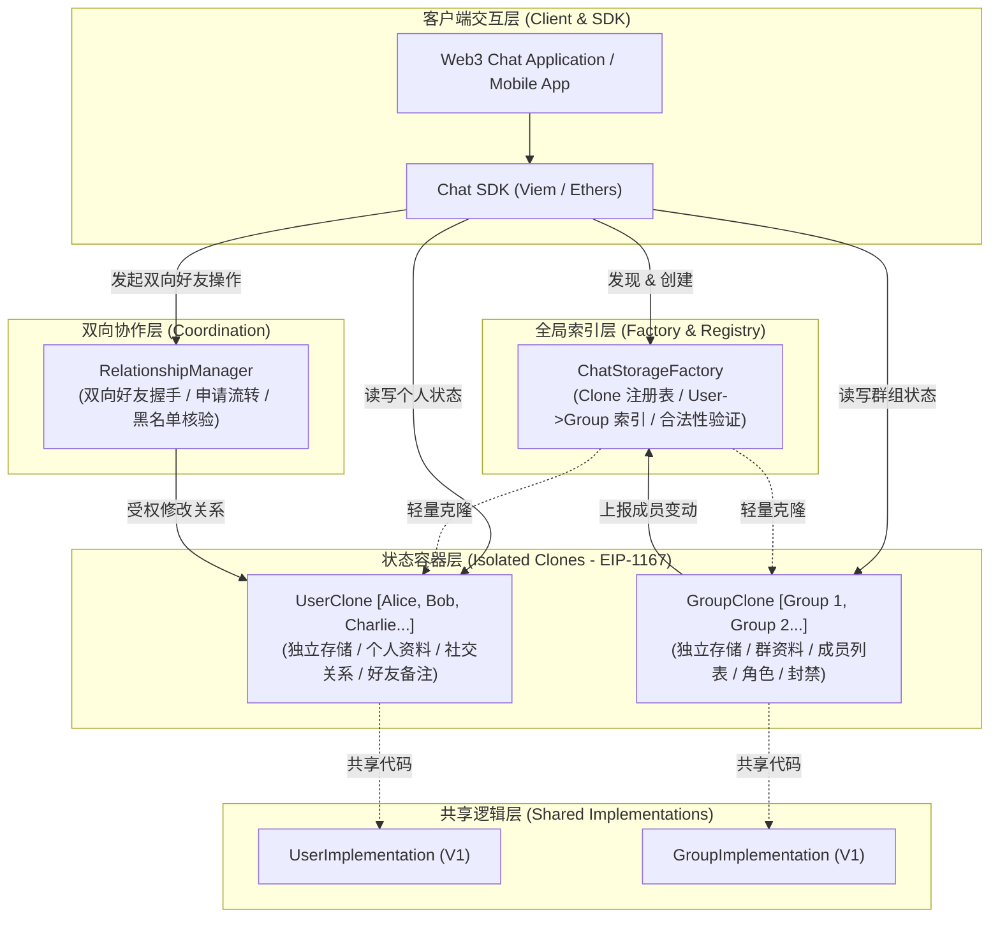
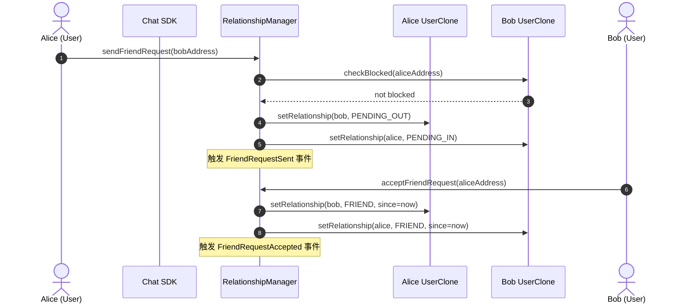
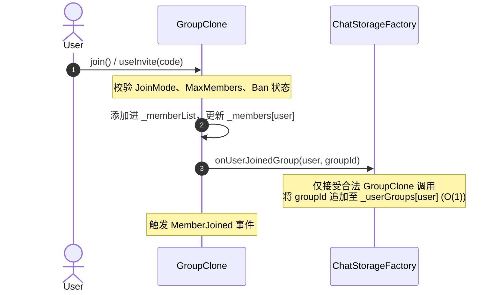

# EVM Chat State Storage Protocol - 系统架构与安全规范 (ARCHITECTURE.md)

## 1. System Topology (系统拓扑与调用流向)

### 1.1 总体分层架构


### 1.2 好友建立流向图 (Bidirectional Friend Handshake)


### 1.3 群组成员加入与索引联动图 (Group Join & Index Sync)


---

## 2. Storage Model & Slot Packing (存储模型与紧凑打包)

为了达到极致 Gas 优化并防止存储槽对齐开销，所有结构体均按 32 字节紧凑排列（Slot Packing）。

### 2.1 UserImplementation 存储布局
```text
Slot 0: [address account (20B)] [uint8 status (1B)] [uint32 metadataVersion (4B)] [uint32 stateVersion (4B)] (剩余 3B 预留)
Slot 1: bytes internal _metadata; (可扩展 UTF-8 JSON，上限 4KB)
Slot 2: bytes internal _state; (可扩展 UTF-8 JSON，上限 4KB)
Slot 3: mapping(address => FriendRecord) internal _friends;
Slot 4: address[] internal _friendList; (仅存放当前有效 FRIEND 地址)
Slot 5: mapping(address => uint256) internal _friendIndex; (1-based index 用于 O(1) swap-and-pop)
Slot 6: mapping(address => bytes) internal _friendMetadata; (对好友的个人备注，上限 2KB)
Slot 7: mapping(address => uint32) internal _friendMetadataVersion;
```

#### FriendRecord 结构体紧凑打包 (恰好 1 个 Slot / 25 Bytes)：
```solidity
struct FriendRecord {
    FriendStatus status;   // uint8 (1 byte): NONE(0), PENDING_IN(1), PENDING_OUT(2), FRIEND(3), BLOCKED(4)
    uint64 since;          // uint64 (8 bytes): 好友建立时间戳
    uint64 mutedUntil;     // uint64 (8 bytes): 静音到期时间戳 (0 = 未静音)
    uint64 expiresAt;      // uint64 (8 bytes): 好友申请过期时间戳
}
```

### 2.2 GroupImplementation 存储布局
```text
Slot 0: uint256 public groupId;
Slot 1: [address owner (20B)] [uint8 status (1B)] [uint8 joinMode (1B)] (剩余 10B 预留)
Slot 2: address public pendingOwner; (两步所有权确认)
Slot 3: uint256 public maxMembers; (0 = 无上限)
Slot 4: uint256 public memberCount;
Slot 5: uint32 public metadataVersion;
Slot 6: bytes internal _metadata; (群公共资料 UTF-8 JSON，上限 8KB)
Slot 7: mapping(address => MemberRecord) internal _members;
Slot 8: address[] internal _memberList; (仅存放当前有效成员地址)
Slot 9: mapping(address => uint256) internal _memberIndex; (1-based index 用于 O(1) swap-and-pop)
Slot 10: mapping(address => bytes) internal _memberMetadata; (成员在群内的名片，上限 2KB)
Slot 11: mapping(address => uint32) internal _memberMetadataVersion;
Slot 12: mapping(bytes32 => InviteRecord) internal _invites;
```

#### MemberRecord 结构体紧凑打包 (恰好 1 个 Slot / 26 Bytes)：
```solidity
struct MemberRecord {
    MemberStatus status;   // uint8 (1 byte): NONE(0), MEMBER(1), BANNED(2)
    Role role;             // uint8 (1 byte): MEMBER(0), MODERATOR(1), ADMIN(2)
    uint64 joinedAt;       // uint64 (8 bytes): 入群时间戳
    uint64 muteUntil;      // uint64 (8 bytes): 禁言到期时间戳
    uint64 banUntil;       // uint64 (8 bytes): 封禁到期时间戳 (type(uint64).max = 永久)
}
```

#### InviteRecord 结构体紧凑打包 (1 个 Slot / 29 Bytes + 8 Bytes = 2 Slots)：
```solidity
struct InviteRecord {
    address inviter;       // 20 bytes
    uint32 maxUses;        // 4 bytes
    uint32 usedCount;      // 4 bytes
    bool active;           // 1 byte
    uint64 expiresAt;      // 8 bytes (放入下个槽位或合并)
}
```

### 2.3 ChatStorageFactory 存储布局
```text
Slot 0: address public immutable userImplementation;
Slot 1: address public immutable groupImplementation;
Slot 2: address public relationshipManager;
Slot 3: address public owner;
Slot 4: mapping(address => address) internal _userClones; (userAddress => cloneAddress)
Slot 5: mapping(address => bool) internal _isUserClone;
Slot 6: mapping(uint256 => address) internal _groupClones; (groupId => cloneAddress)
Slot 7: mapping(address => uint256) internal _groupCloneToId; (cloneAddress => groupId)
Slot 8: mapping(address => bool) internal _isGroupClone;
Slot 9: address[] internal _allGroups;
Slot 10: mapping(address => uint256[]) internal _userGroups; (userAddress => groupIds)
Slot 11: mapping(address => mapping(uint256 => uint256)) internal _userGroupIndex; (swap-and-pop 索引)
```

---

## 3. Mathematical & State Invariants (核心不变量与数学守恒)

### 3.1 成员数与列表不变量 (Membership Invariants)
$$\text{memberCount} == \text{\_memberList.length}$$
- 任意成员加入时：`memberCount++`，`_memberList.push(user)`；
- 成员被移出（leave / remove / ban）时：`memberCount--`，使用 `swap-and-pop` 保证 `_memberList` 元素连续性与索引对齐；
- 若设置了 `maxMembers > 0`，则在任何加入前必须严格满足：
$$\text{memberCount} < \text{maxMembers}$$

### 3.2 好友列表与状态不变量 (Friend Invariants)
$$\text{friendCount} == \text{\_friendList.length}$$
- 仅当且仅当 `_friends[user].status == FriendStatus.FRIEND` 时，该地址存在于 `_friendList` 中；
- 当状态跃迁为 `BLOCKED`、`NONE` 时，必须从 `_friendList` 剔除；
- 双向关系一致性：Alice 视 Bob 为 FRIEND 时，经由 `RelationshipManager` 协同保证 Bob 必然视 Alice 为 FRIEND。

### 3.3 权限防越权不变量 (Role Monotonicity & Boundary)
$$\text{Caller Role} > \text{Target Current Role}$$
$$\text{Caller Role} \ge \text{Target New Role}$$
- 禁止平级或越级操作（如 Moderator 不能踢出 Moderator 或 Admin，不能修改其角色）；
- Owner 转移必须经过待接收阶段：
$$\text{owner} \to \text{pendingOwner} \xrightarrow{\text{accept}} \text{owner}$$

### 3.4 状态机合法流转图
```text
User Friend Request:
  NONE ──(send)──> PENDING_OUT (Alice) / PENDING_IN (Bob)
  PENDING_IN ──(accept)──> FRIEND
  PENDING ──(reject/cancel)──> NONE
  FRIEND ──(remove)──> NONE
  ANY ──(block)──> BLOCKED
  BLOCKED ──(unblock)──> NONE

Group Status:
  ACTIVE ──(pause)──> PAUSED ──(resume)──> ACTIVE
  ACTIVE / PAUSED ──(close)──> CLOSED (Terminal)
```

---

## 4. Threat Model & Security Controls (威胁模型与防御策略)

| 攻击威胁 / 漏洞类型 | 潜在危害 | 协议防御策略 |
|---|---|---|
| **Logic Implementation 夺权** | 攻击者直接初始化共享 Implementation 合约夺取特权 | 在 Implementation 的构造函数中调用 `_disableInitializers()`，彻底封禁逻辑合约被初始化的可能 |
| **Clone 身份伪造 (Impersonation)** | 恶意合约冒充 GroupClone 调用 Factory 的 `onUserJoinedGroup` 污染索引 | Factory 内部维护严格的 `_isGroupClone[msg.sender]` 白名单校验，非授权地址调用立即 revert `UnauthorizedClone()` |
| **重入与恶意外部调用 (Reentrancy)** | 接收者通过 ERC-721/1155 回调或自定义回退函数重入篡改状态 | 纯状态存储模型，完全不执行外部任意转账或向不可信地址派发未受信 external call；所有状态修改遵循 CEI 模式 |
| **超大 JSON 导致的 DoS / Gas 耗尽** | 攻击者存储兆级 payload 导致节点 RPC 崩溃或读取超时 | 在合约中对写入的 `bytes` 施加严格硬限（User/State ≤ 4KB, Group ≤ 8KB, Member/Friend ≤ 2KB），超限 revert `MetadataSizeExceeded()` |
| **大数组遍历 Gas Limit DoS** | 成员或好友达数万人时，查询导致 Gas 超过区块上限 | 合约禁止任何无界循环遍历；所有批量查询（`getMembers`, `getFriends`, `getUserGroups`, `getGroups`）强制支持 `offset` 与 `limit` 分页 |
| **两步所有权误操作丢失** | 将 Owner 误设为 `address(0)` 或错误地址导致群组永久丧失控制权 | 强制使用 `pendingOwner` 两步确认机制，必须由新地址主动发起 `acceptOwnership()` 方能生效 |
| **零地址 (address(0)) 穿透** | 恶意或失误将 `address(0)` 作为用户或成员登记 | 所有入口函数显式检查 `if (account == address(0)) revert ZeroAddress();` |

---

## 5. Off-chain & Client Integration (链下客户端与强类型 SDK 集成)

1. **强类型 SDK 抽象 (User-centric & Group-centric)**：
   - 开发者通过统一的 `sdk.user()` 与 `sdk.group(groupId)` 交互，底层自动解析对应的 Clone 合约地址，无需关心 Clone 的具体工厂调用；
2. **交易本地模拟 (eth_call / simulateContract)**：
   - SDK 在向链上发送交易前，自动通过本地节点预估并模拟执行，提前捕获群人数已满（`GroupFull`）、被拉黑（`UserBlocked`）、权限不足（`Unauthorized`）等 Custom Error，避免用户损耗 Gas；
3. **事件驱动增量同步 (Incremental Event Indexing)**：
   - 链下 Indexer / 消息服务器仅需订阅 Factory 与各 Clone 发出的标准事件（`MemberJoined`, `MemberBanned`, `FriendRequestAccepted`），即可构建实时高速状态缓存。
