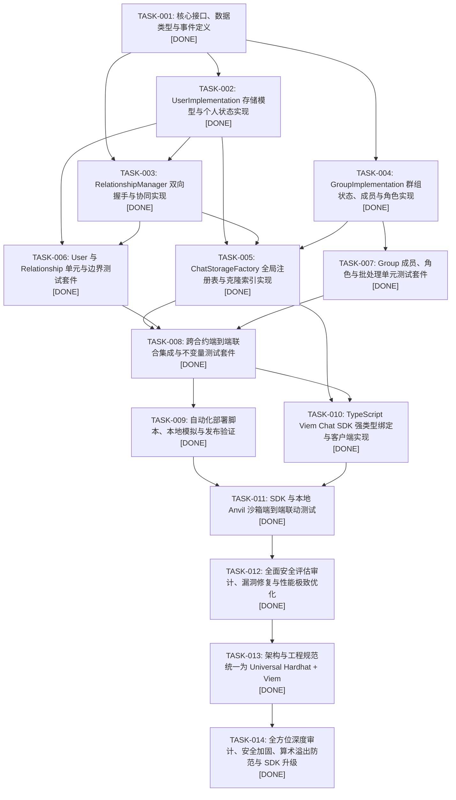

# EVM Chat State Storage Protocol - 任务索引表 (TASK_INDEX.md)

本文档定义 EVM Chat State Storage Protocol 的完整工程研发序列、依赖拓扑与执行状态。

---

## 任务依赖拓扑图 (Dependency Graph)

---

## 任务索引清单 (Task Index Table)

| 任务编号 | 任务名称 | 目标模块 | 前置依赖 | 状态 | 预期成果物 |
|---|---|---|---|---|---|
| **TASK-001** | 核心接口、数据类型与事件定义 | `contracts/interfaces/` | None (冷启动就绪) | `DONE` | `IChatStorageFactory.sol`, `IUserImplementation.sol`, `IGroupImplementation.sol`, `IRelationshipManager.sol`, `ChatErrors.sol`, `ChatEvents.sol` |
| **TASK-002** | UserImplementation 存储模型与个人状态实现 | `contracts/UserImplementation.sol` | TASK-001 | `DONE` | 核心 UserClone 逻辑合约：个人 Profile、State、好友查询、好友备注、静音与拉黑 |
| **TASK-003** | RelationshipManager 双向握手与协同实现 | `contracts/RelationshipManager.sol` | TASK-001, TASK-002 | `DONE` | 双向好友申请、接受、拒绝、解除、黑名单拦截协调合约 |
| **TASK-004** | GroupImplementation 群组状态、成员与角色实现 | `contracts/GroupImplementation.sol` | TASK-001 | `DONE` | 群核心容器：两步所有权、角色管理、JoinMode、批量加/踢/禁言/封禁、邀请码、群内名片 |
| **TASK-005** | ChatStorageFactory 全局注册表与克隆索引实现 | `contracts/ChatStorageFactory.sol` | TASK-002, TASK-003, TASK-004 | `DONE` | 工厂合约：部署 User/Group 克隆、双向 ID 映射、全局分页发现、User->Groups 索引维护与鉴权 |
| **TASK-006** | User 与 Relationship 单元与边界测试套件 | `test/unit/UserAndRelationship.test.ts` | TASK-002, TASK-003 | `DONE` | 用户资料、好友握手、黑名单、静音、权限及尺寸限制单元测试 100% 通过 |
| **TASK-007** | Group 成员、角色与批处理单元测试套件 | `test/unit/Group.test.ts` | TASK-004 | `DONE` | 群生命周期、角色分级防越权、批量操作、两步所有权、邀请码测试 100% 通过 |
| **TASK-008** | 跨合约端到端联合集成与不变量测试套件 | `test/integration/EndToEndChatFlow.test.ts` | TASK-005, TASK-006, TASK-007 | `DONE` | 用户注册 -> 建群 -> 邀请加群 -> Factory 索引联动 -> 好友协同完整业务流测试 |
| **TASK-009** | 自动化部署脚本、本地模拟与发布验证 | `scripts/deploy.ts` | TASK-008 | `DONE` | 幂等 TypeScript Viem 部署脚本、本地沙箱广播通过、`deployments/` 产物自动生成 |
| **TASK-010** | TypeScript Viem Chat SDK 强类型绑定与客户端实现 | `sdk/src/` | TASK-005, TASK-008 | `DONE` | `@web3-chat/sdk`：ChatSDK, UserClient, GroupClient, RelationshipClient, Viem ABI 导出与模拟预检 |
| **TASK-011** | SDK 与本地 Anvil 沙箱端到端联动测试 | `sdk/test/e2e/e2e.test.ts` | TASK-009, TASK-010 | `DONE` | 本地沙箱自动部署合约，运行 TypeScript SDK 完成注册、建群、改名片、双向好友真实链上交互断言 |
| **TASK-012** | 全面安全评估审计、漏洞修复与性能极致优化 | `contracts/`, `sdk/` | TASK-011 | `DONE` | 修复黑名单绕过/升级割裂/过期死锁/原型污染，消除群成员计数 SSTORE |
| **TASK-013** | 架构与工程规范统一为 Universal Hardhat + Viem | `contracts/`, `test/`, `scripts/`, `deployments/` | TASK-012 | `DONE` | 规整为 Monorepo 标准，配置 Hardhat + Viem 测试与部署，清理 Foundry 遗留，36 项全量测试 100% 通过 |
| **TASK-014** | 全方位深度审计、安全加固、算术溢出防范与 SDK 升级 | `contracts/`, `sdk/` | TASK-013 | `DONE` | 封堵分页加法溢出，补齐 UserDisabled 与 MemberMuted 状态拦截，加固所有权 ADMIN 守恒，落地 SDK Event Watching、密码学邀请码及 RPC 故障自愈，全量 49 项测试 100% 通过 |

---

## 状态说明
- `TODO`: 任务已定义，前置依赖就绪后待开始
- `IN_PROGRESS`: 当前会话正在开发
- `REVIEW`: 编码完毕，正在进行完整验证
- `DONE`: 满足 10 条完成判定标准，全部测试通过
- `BLOCKED`: 外部阻塞
